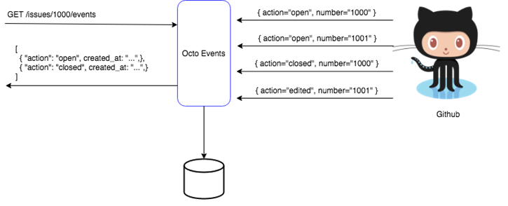
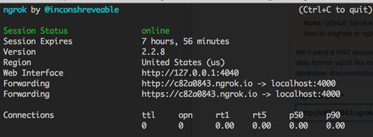

# Octo Events

OctoEvents is an application that receives Github events by Webhooks and exposes them by API for future consumption.



The application have 2 endpoints:

## 1. Endpoint Webhook
```
This endpoint receives events from Github and persist on Database.

/POST /events
```

## 2. Endpoint Events
```
The Events endpoint will expose the events via an API that will filter them through the Issue number:

GET /events/1
```

## 3. Running the application
```
** Instale o MYSQL **

* 1-) Make sure you have installed MYSQL in your localhost, the database will be used to save the events notified by Webhook.

** Running the applications **

* 2-) Execute OctoApplication.java by Java Application. (The application is config to run on port 4000).

** Instructions for integration with Github **

* 3-) Use ngrok (https://ngrok.com/) to install/debug GitHub webhook calls. This application generates
  a public url that will route your machine, run the command below:

  $ sudo ngrok http 4000

* 3-) Copy the url generated by ngrok and paste it into the GitHub repository you want to receive notifications from:
  

  GitHub


 
```
